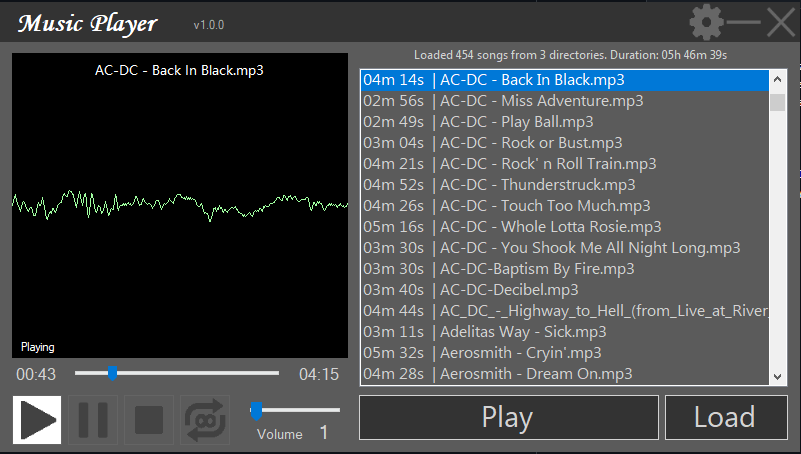

# MusicPlayerApp

Aplikacja na platformę Windows zaprojektowana w celu ułatwienia odtwarzania muzyki z wielu folderów.
Program pozwala na układanie listy utworów z wielu folderów w jedną listę
oraz umożliwia odsłuchiwanie oraz kontrolowanie odtwarzania muzyki.

## Instalacja

W celu uruchomienia programu należy pobrać najnowszą wersję z listy wydań oraz wypakować plik w wybranym folderze.
Po uruchomieniu aplikacji należy wpisać pełne ścieżki do folderów do pliku paths.txt poprzez ustawienia wewnątrz aplikacji lub bezpośrednio do pliku.

